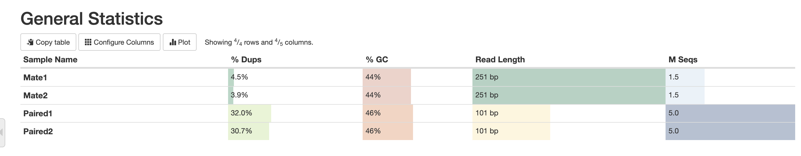
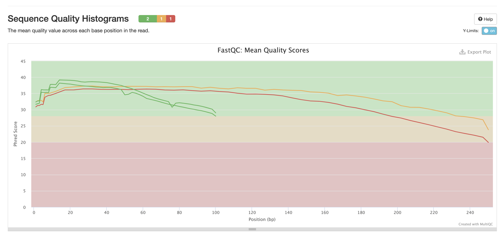
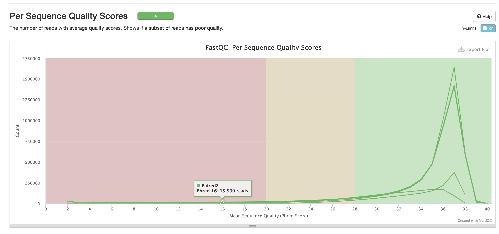
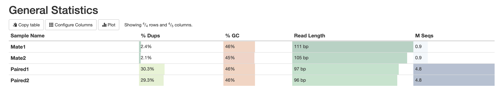
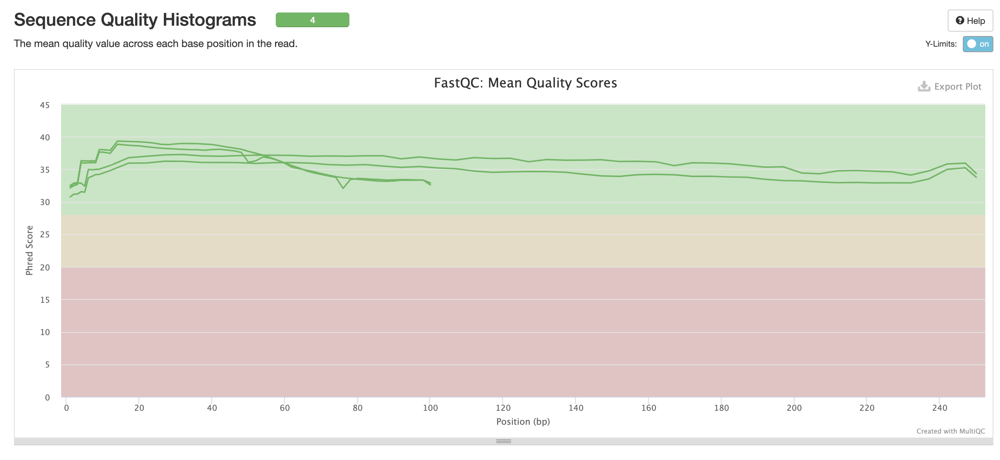
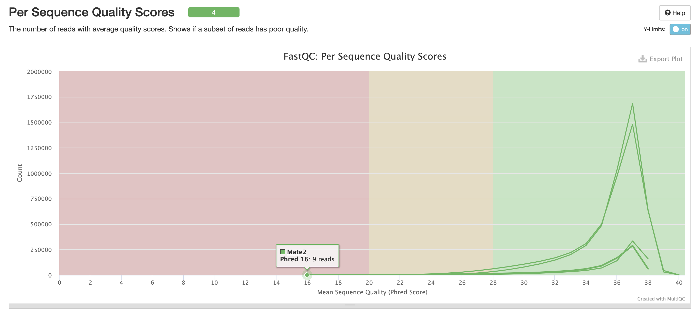

## Основное задание

### Создаю подпапку в домашней папке для работы
```bash
mkdir hw1
cd hw1
```

### Создаем символические ссылки на общие файлы

```bash
ln -s /usr/share/data-minor-bioinf/assembly/oil_R1.fastq
ln -s /usr/share/data-minor-bioinf/assembly/oil_R2.fastq
ln -s /usr/share/data-minor-bioinf/assembly/oilMP_S4_L001_R1_001.fastq
ln -s /usr/share/data-minor-bioinf/assembly/oilMP_S4_L001_R2_001.fastq
```


### Случайно выбираем 5 миллионов paired-end чтений и 1.5 миллиона mate-pairs чтений:

```bash
seqtk sample -s729 oil_R1.fastq 5000000 > Paired1.fastq
seqtk sample -s729 oil_R2.fastq 5000000 > Paired2.fastq
seqtk sample -s729 oilMP_S4_L001_R1_001.fastq 1500000 > Mate1.fastq
seqtk sample -s729 oilMP_S4_L001_R2_001.fastq 1500000 > Mate2.fastq
```

### Оцениваем качество исходных чтений с помощью fastqc и получаем статистику с помощью multiqc 

```bash
mkdir fastqc
fastqc Paired1.fastq Paired2.fastq Mate1.fastq Mate2.fastq -o fastqc
multiqc fastqc -o multiqc_stat
```

### Скриншоты из статистики 




Полную статистику можно увидеть в отчете: [multiqc_report.html](multiqc_stat/multiqc_report.html)
### Подрезаем чтения по качеству и удаляем адаптеры:

```bash
aamakogon@bioinflab-2:~/homeworks/hw1$ platanus_trim Paired1.fastq Paired2.fastq
Running with trim adapter mode
Checking files:
  Paired1.fastq Paired2.fastq  (100%)

Number of trimmed read with adapter:
NUM_OF_TRIMMED_READ(FORWARD) = 209325
NUM_OF_TRIMMED_BASE(FORWARD) = 207306
NUM_OF_TRIMMED_READ(REVERSE) = 209377
NUM_OF_TRIMMED_BASE(REVERSE) = 356005
NUM_OF_TRIMMED_PAIR(OR) = 209402
NUM_OF_TRIMMED_PAIR(AND) = 209300


Number of trimmed read because of low quality or too short (< 11bp):
NUM_OF_TRIMMED_READ(FORWARD) = 908170
NUM_OF_TRIMMED_BASE(FORWARD) = 18123206
NUM_OF_TRIMMED_READ(REVERSE) = 1179208
NUM_OF_TRIMMED_BASE(REVERSE) = 35915728
NUM_OF_TRIMMED_PAIR(OR) = 1631008
NUM_OF_TRIMMED_PAIR(AND) = 456370


#### PROCESS INFORMATION ####
User Time:           1.11 min
System Time:         0.03 min
VmPeak:           0.116 GByte
VmHWM:            0.110 GByte
Execution time:      1.48 min
```

И вторую часть:

```bash
aamakogon@bioinflab-2:~/homeworks/hw1$ platanus_internal_trim Mate1.fastq Mate2.fastq
Running with trim internal adapter mode
Checking files:
  Mate1.fastq Mate2.fastq  (100%)

Number of trimmed read with internal adapter:
NUM_OF_TRIMMED_READ(FORWARD) = 972187
NUM_OF_TRIMMED_BASE(FORWARD) = 169676205
NUM_OF_TRIMMED_READ(REVERSE) = 956519
NUM_OF_TRIMMED_BASE(REVERSE) = 171400779
NUM_OF_TRIMMED_PAIR(OR) = 1188277
NUM_OF_TRIMMED_PAIR(AND) = 740429


Number of trimmed read with adapter:
NUM_OF_TRIMMED_READ(FORWARD) = 11188
NUM_OF_TRIMMED_BASE(FORWARD) = 366246
NUM_OF_TRIMMED_READ(REVERSE) = 11215
NUM_OF_TRIMMED_BASE(REVERSE) = 388895
NUM_OF_TRIMMED_PAIR(OR) = 11217
NUM_OF_TRIMMED_PAIR(AND) = 11186


Number of trimmed read because of low quality or too short (< 11bp):
NUM_OF_TRIMMED_READ(FORWARD) = 361241
NUM_OF_TRIMMED_BASE(FORWARD) = 11707276
NUM_OF_TRIMMED_READ(REVERSE) = 468737
NUM_OF_TRIMMED_BASE(REVERSE) = 23928551
NUM_OF_TRIMMED_PAIR(OR) = 724455
NUM_OF_TRIMMED_PAIR(AND) = 105523


#### PROCESS INFORMATION ####
User Time:           1.13 min
System Time:         0.01 min
VmPeak:           0.167 GByte
VmHWM:            0.161 GByte
Execution time:      1.18 min
```

### Оцениваем качество подрезанных чтений с помощью fastqc и получаем статистику с помощью multiqc: 

```bash
mkdir fastqc_trimmed
fastqc Paired1.fastq.trimmed Paired2.fastq.trimmed Mate1.fastq.int_trimmed Mate2.fastq.int_trimmed -o fastqc_trimmed
multiqc fastqc_trimmed -o multiqc_trimmed_stat
```

### Скриншоты из статистики




Полную статистику можно увидеть в отчете: [multiqc_trimmed_report.html](multiqc_trimmed_stat/multiqc_report.html)


### Собираем контиги (platanus assemble)

```bash
platanus assemble -f Paired1.fastq.trimmed Paired2.fastq.trimmed -o Paired
```

### Собираем скаффолды из контигов и подрезанных чтений (platanus scaffold)

```bash
platanus scaffold -c Paired_contig.fa -b Paired_contigBubble.fa -IP1 Paired1.fastq.trimmed Paired2.fastq.trimmed -OP2 Mate1.fastq.int_trimmed Mate2.fastq.int_trimmed -o scaff
```

### Избавляемся от гэпов (platanus gap_close):

```bash
platanus gap_close -c scaff_scaffold.fa -IP1 Paired1.fastq.trimmed Paired2.fastq.trimmed -OP2 Mate1.fastq.int_trimmed Mate2.fastq.int_trimmed -o gapres
```


## Бонусное задание

Сделаем все то же самое, но на меньшем количестве данных (на 300000 и 100000 соответственно)

```bash
seqtk sample -s729 oil_R1.fastq 300000 > bonus_paired1.fastq
seqtk sample -s729 oil_R2.fastq 300000 > bonus_paired2.fastq
seqtk sample -s729 oilMP_S4_L001_R1_001.fastq 100000 > bonus_mate1.fastq
seqtk sample -s729 oilMP_S4_L001_R2_001.fastq 100000 > bonus_mate2.fastq
mkdir bonus_fastqc
fastqc bonus_paired1.fastq bonus_paired2.fastq bonus_mate1.fastq bonus_mate2.fastq -o bonus_fastqc
multiqc bonus_fastqc -o bonus_multiqc_result
platanus_trim bonus_paired1.fastq bonus_paired2.fastq
platanus_internal_trim bonus_mate1.fastq bonus_mate2.fastq
mkdir bonus_fastqc_result
fastqc bonus_paired1.fastq.trimmed bonus_paired2.fastq.trimmed bonus_mate1.fastq.int_trimmed bonus_mate2.fastq.int_trimmed -o bonus_fastqc_result
multiqc bonus_fastqc_result -o bonus_multiqc_trimmed_result
platanus assemble -f bonus_paired1.fastq.trimmed bonus_paired2.fastq.trimmed -o bonus_result
platanus scaffold -c bonus_result_contig.fa -b bonus_result_contigBubble.fa -IP1 bonus_paired1.fastq.trimmed bonus_paired2.fastq.trimmed -OP2 bonus_mate1.fastq.int_trimmed bonus_mate2.fastq.int_trimmed -o bonus_result
platanus gap_close -c bonus_result_scaffold.fa -IP1 bonus_paired1.fastq.trimmed bonus_paired2.fastq.trimmed -OP2 bonus_mate1.fastq.int_trimmed bonus_mate2.fastq.int_trimmed -o bonus_result
```


## Удалим все вспомогательные файлы на сервере:

```bash
rm -rf hw1
```